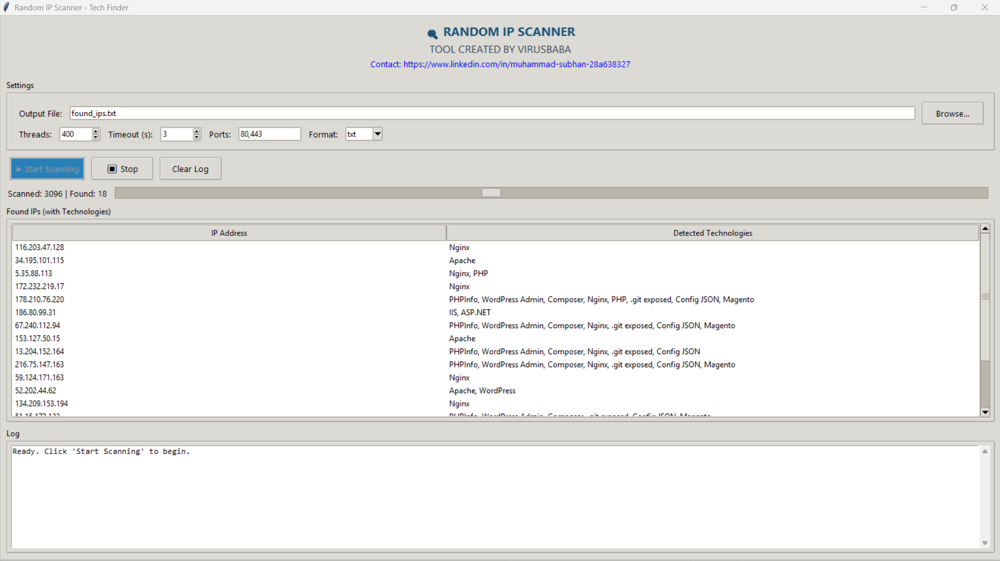

# 🌐 Random Web Scanner

**Random Web Scanner** is a Python GUI tool that continuously generates random global IPv4 addresses, checks for live web services on custom ports, and fingerprints the underlying technologies (WordPress, Laravel, PHP, ASP.NET, Nginx, etc.). It’s built for **ethical security research**, **bug bounty reconnaissance**, and **asset discovery** – with explicit authorisation only.

 <!-- Add your own screenshot -->

---

## ✨ Features

- 🔀 **Random IPv4 generation** – scans the entire public IPv4 space (no duplicates)
- 🎯 **Custom port scanning** – define any port (e.g., 80, 443, 8080, 8443, 9000)
- ⚡ **Multi‑threaded** – adjustable thread count for speed vs. stealth
- 🧩 **Technology fingerprinting** – detects:
  - Web servers: Nginx, Apache, IIS, LiteSpeed
  - Frameworks: Laravel, WordPress, Drupal, Joomla
  - Languages: PHP, ASP.NET, Python (Django/Flask), Node.js
  - Exposed files: `.git/HEAD`, `phpinfo()`, `config.json`, `wp-config.php`
- 💾 **Export results** – save discovered IPs + tech details to **TXT**, **CSV**, or **JSON**
- 🛑 **Stop‑on‑demand** – gracefully halts scanning when you close the GUI or press `Ctrl+C`
- 📊 **Live counter** – shows total scanned IPs, live hits, and tech distribution

---

## 🛠️ Installation

### Prerequisites
- Python 3.8+
- `pip` (Python package manager)

### Steps
```bash
# Clone the repository
git clone https://github.com/yourusername/RandomWebScanner.git
cd RandomWebScanner

# Install required packages
pip install -r requirements.txt
